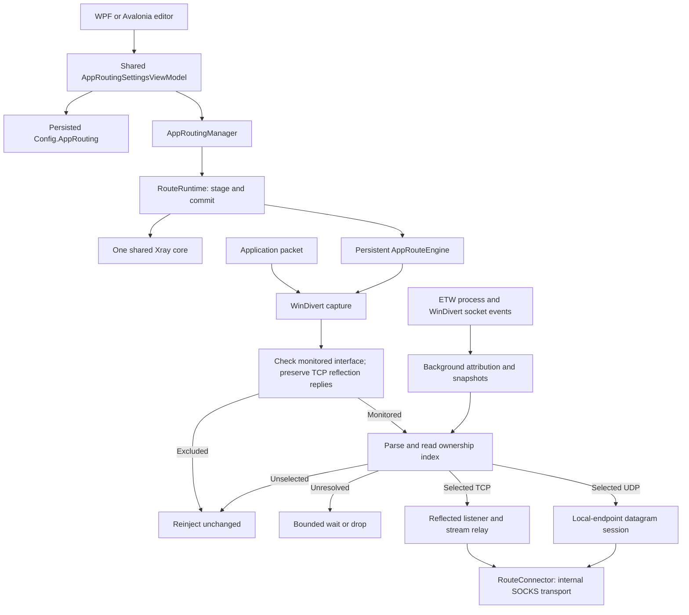

# Application routing: code walkthrough for reviewers

This guide explains the Windows application-routing implementation, its ownership
boundaries, and the reasoning behind the less obvious code. It describes the
current source, including behavior that still needs native integration testing.
For user instructions, build commands, supported destinations, and the runtime
validation matrix, see [Application routing for Windows](application-routing.md).

Application routing selects an outbound for an executable without requiring that
executable to support proxies. WinDivert supplies outbound IP packets and passive
socket events; ETW process events and Windows snapshots identify their owners.
Selected TCP connections are reflected into
local TCP listeners and relayed as streams. Selected UDP datagrams are sent
through relay sockets shared by each process/local endpoint/rule. Both paths
preserve the remote address and port that the application expects to see.

## Suggested reading order

All source links are relative to this document so they work in a repository
browser. Method names are used instead of line numbers to keep the guide useful
as the implementation changes.

| Read | Files | Main review question |
| --- | --- | --- |
| 1 | [AppRoutingItem.cs](../v2rayN/ServiceLib/Models/Configs/AppRoutingItem.cs), [AppRoutingManager.cs](../v2rayN/ServiceLib/Manager/AppRoutingManager.cs) | What is persisted, and what happens on start, stop, and failure? |
| 2 | [AppRoutingSettingsViewModel.cs](../v2rayN/ServiceLib/ViewModels/AppRoutingSettingsViewModel.cs) | When do draft edits become saved rules and running routes? |
| 2a | [RouteInterfaceCatalog.cs](../v2rayN/ServiceLib/Services/AppRouting/RouteInterfaceCatalog.cs), [RouteInterfaceMonitor.cs](../v2rayN/ServiceLib/Services/AppRouting/RouteInterfaceMonitor.cs), [AppRoutingInterfaceViewModel.cs](../v2rayN/ServiceLib/ViewModels/AppRoutingInterfaceViewModel.cs) | How are adapter choices remembered and applied without replacing the capture engine? |
| 3 | [AppRoutingManager.cs](../v2rayN/ServiceLib/Manager/AppRoutingManager.cs), [RouteRuntime.cs](../v2rayN/ServiceLib/Services/AppRouting/RouteRuntime.cs), [RouteProfileInstance.cs](../v2rayN/ServiceLib/Services/AppRouting/RouteProfileInstance.cs) | Who prepares, commits, supervises and retires runtime resources? |
| 4 | [RouteSharedRules.cs](../v2rayN/ServiceLib/Services/AppRouting/RouteSharedRules.cs), [RouteAttribution.cs](../v2rayN/ServiceLib/Services/AppRouting/RouteAttribution.cs), [RouteOwnerTable.cs](../v2rayN/ServiceLib/Services/AppRouting/RouteOwnerTable.cs), [RouteProcessTree.cs](../v2rayN/ServiceLib/Services/AppRouting/RouteProcessTree.cs) | How does a packet acquire a main-table routing target? |
| 4a | [RouteProcessEvents.cs](../v2rayN/ServiceLib/Services/AppRouting/RouteProcessEvents.cs), [RouteSocketEvents.cs](../v2rayN/ServiceLib/Services/AppRouting/RouteSocketEvents.cs) | How are short-lived processes and closed sockets retained without following reused identities? |
| 5 | [AppRouteEngine.cs](../v2rayN/ServiceLib/Services/AppRouting/AppRouteEngine.cs), [RouteNatTable.cs](../v2rayN/ServiceLib/Services/AppRouting/RouteNatTable.cs) | How do TCP reflection, connection reuse, and shutdown work? |
| 6 | [RouteUdpSession.cs](../v2rayN/ServiceLib/Services/AppRouting/RouteUdpSession.cs), [RouteConnector.cs](../v2rayN/ServiceLib/Services/AppRouting/RouteConnector.cs) | How are UDP ownership, SOCKS negotiation, and internal profile endpoints handled? |
| 7 | [RoutePacket.cs](../v2rayN/ServiceLib/Services/AppRouting/RoutePacket.cs), [RoutePacketBatch.cs](../v2rayN/ServiceLib/Services/AppRouting/RoutePacketBatch.cs), [RouteFragmentBuffer.cs](../v2rayN/ServiceLib/Services/AppRouting/RouteFragmentBuffer.cs), [WinDivertApi.cs](../v2rayN/ServiceLib/Services/AppRouting/WinDivertApi.cs) | Which packet and native-layout assumptions require care? |
| 8 | [AppRouting tests](../v2rayN/ServiceLib.Tests/AppRouting) | Which behaviors have deterministic coverage, and which require a dedicated Windows host? |

## 1. Architecture and responsibilities

The main separation is between configuration, resource ownership, and packet
handling. The editor does not own interception. Closing its window disposes its
bindings and commands; the singleton manager continues running the routes.



`AppRoutingManager` serializes runtime changes, prepares the shared routing core,
and supervises a `RouteRuntime`. That runtime owns the exclusive capture lease,
engine, and one Xray instance. `RouteProfileInstance` owns
its process, job, generated file, and authenticated listener endpoint.
`AppRouteEngine` owns the capture handle, local TCP listeners, connection/session
tables, and the background attribution source. `RouteConnector` establishes an
outbound, but does not select a rule or modify persisted configuration.

`RefreshAsync` applies the saved enabled preference directly. `RouteRuntime`
accepts injected engine, core-start and lease operations so tests exercise the
production ownership transitions without starting a driver or a core.

### Windows App package groups

Windows App blocks contain stable package-family identities with enabled and
Children flags. Normal table order decides between overlapping process/package
rules. Both UIs share AppRoutingPackageViewModel: its owned dialog edits detached
checkbox rows, retains missing selected packages, and preserves checks across
searches. Confirmation updates the rule draft; saving the routing set applies
membership, flags and destination together. Loading/import run off the UI thread,
and late completions cannot update a disposed picker.
`RoutePackageCatalog` reads the current account's installed packages with
`PackageManager.FindPackagesForUser`, omitting framework/resource packages and
bundles. The account is shown explicitly, including when elevation uses another
user's credentials. It uses a small private WinRT ABI adapter because ServiceLib
also targets non-Windows platforms; importing Windows SDK projections into that
shared target would change its platform contract. The adapter includes explicit
interface IDs/slot comments, one-byte WinRT booleans, HRESULT checks, and scoped
COM/HSTRING lifetimes. No PowerShell subprocess, registry layout assumptions or
package-directory parsing are involved. Read-only native tests exercise it on
both Windows process architectures. Localized display metadata may be missing;
identity remains usable with the package's canonical name as a fallback.

`RouteLoopbackImport` reads `NetworkIsolationGetAppContainerConfig`, derives each
installed package's AppContainer SID and maps equal SIDs back to family names.
It reports unmatched entries and merges matching packages into the
dialog. There is deliberately no Windows permission setter. SID arrays and their
individual entries use process-heap cleanup as specified by Microsoft; derived
SIDs use `FreeSid`. The import's selections only take effect after the user confirms
the package dialog and saves the main rule draft.

`RouteProcessInfo.PackageFamily` comes from `GetPackageFamilyName` on the retained
process handle, or `PackageFamilyNameFromFullName` on optional ETW start metadata.
No extra observer or packet-time OS lookup is added. A null identity is unknown;
empty means unpackaged. Older ETW payloads lacking the field remain unknown until
a process snapshot can resolve them. Merge keeps known families through sparse
events/stops without transferring identity across recycled PIDs. Unknown package
identity delays a decision while it could change rule membership. The main table determines precedence; Children extends each selected row to its observed descendants. Core exclusions and
generation/QPC safeguards still apply before routing.

Package matching does not recover the original caller once its traffic is inside
the existing local proxy. Capture still excludes loopback and core-owned sockets;
supporting per-package destinations for already-proxied traffic would require a
separate caller-aware proxy frontend. The package dialog and user documentation
state this boundary. No exemptions are removed to try to force a different path.

API references: [package enumeration](https://learn.microsoft.com/en-us/uwp/api/windows.management.deployment.packagemanager.findpackagesforuser),
[process package identity](https://learn.microsoft.com/en-us/windows/win32/api/appmodel/nf-appmodel-getpackagefamilyname),
[ETW package-name conversion](https://learn.microsoft.com/en-us/windows/win32/api/appmodel/nf-appmodel-packagefamilynamefromfullname),
[read-only loopback configuration and ownership](https://learn.microsoft.com/en-us/windows/win32/api/netfw/nf-netfw-networkisolationgetappcontainerconfig).

### Interface selection and discovery

`AppRoutingItem.InterfaceMonitoring` stores the default for new adapters and
each known adapter's stable ID, last known name, and monitored flag. The default
is `true` for backward compatibility. `RouteInterfaceCatalog.Discover` returns
a copied options snapshot, assigns the default only to previously unseen IDs,
and retains removed adapters. This avoids changing old choices when the user
changes the default. `RouteInterfaceNative` reads Windows' `MIB_IF_ROW2` filter
flag through `GetIfTable2` so NDIS filter modules (Npcap, QoS, etc.) are not
enumerated as separate choices. This uses OS metadata rather than name matching;
real VPN/virtual and disconnected adapters remain selectable. Filter modules
are parts of an adapter's stack, not independent IP interfaces to route through.
Only non-loopback, non-filter adapters are discovered. The picker hides historical
entries, including filter IDs saved by older builds, without deleting remembered
choices for absent adapters. Both UIs use fixed-height checkbox rows in one
non-virtualized scroll area, avoiding variable-height DataGrid scroll estimates.

The native layout is checked against actual Windows interface GUIDs and indexes
in both test-host architectures. See Microsoft's
[MIB_IF_ROW2 documentation](https://learn.microsoft.com/en-us/windows/win32/api/netioapi/ns-netioapi-mib_if_row2)
for the `FilterInterface` flag and layout.

`RouteInterfaceMonitor`, owned by the manager for the application lifetime,
serializes discovery and picker commits. It runs even when routing is off, reacts
to `NetworkAddressChanged`, and scans every five seconds to catch inactive
adapters. It writes only when persisted values change. The dialog edits separate
rows; saving overlays only those rows onto the latest discovered set so adapters
that appeared while the dialog was open keep their own choices. Failure to save
restores the previous options and does not publish a new policy. `ConfigHandler`
serializes saves around its common temporary file now that discovery can save
concurrently with UI actions.

The packet path reads an immutable `RouteInterfacePolicy`: a lookup from each
IPv4/IPv6 interface index to adapter ID and monitored flag. Indexes are never
persisted. On a changed snapshot, the engine retires connections, UDP sessions,
pending attribution packets, and incomplete fragments whose interface was
excluded or whose index now belongs to another adapter. Unaffected routes stay
open. UDP ownership validation also checks the latest interface policy before
both sending and delivering a reply, including while the capture worker is idle.

Ordinary excluded traffic skips process matching and the unresolved-packet
queue. The WinDivert handle remains broad and persistent; exclusion is applied
in the packet dispatcher rather than by reopening the driver whenever adapters
change. This retains batching and avoids interrupting unrelated connections.
It does not remove WinDivert's capture/reinjection cost on excluded traffic.
Reverse TCP translation precedes exclusion, because Windows may select an
excluded adapter for the relay listener's response. Reverse entries remain
available briefly after retirement to contain late FIN/RST packets.

Excluded UDP fragments and TCP fragments with no possible reverse mapping pass
through immediately, including out-of-order fragments. TCP fragments between
addresses that still have a reverse mapping need normal bounded reassembly to
read the translated port safely. This conservative case can also delay other
fragmented TCP traffic between those addresses. Unknown indexes use the new
adapter default until discovery resolves them; a missed index-reuse notification
can leave the previous snapshot in use until the fallback scan. Neither interface
selection nor process sampling is a security boundary. Native adapter/VPN tests
must cover these transitions independently of deterministic tests.

## 2. Persisted model and executable matching

`Config.AppRouting` contains only the global Enabled preference and monitored
interface choices. Old standalone Rules fields are unknown JSON and ignored,
including disabled or invalid preview entries. The main routing table stores all
application selectors and destinations; see [the block-editor guide](routing-block-editor.md).
Process rows infer full path, folder or executable-name matching from their value.
Windows App rows persist family identity, not localized names. Those names are
loaded asynchronously for display and sorting only.

The observer's `RouteSharedPolicy` creates immutable
[RouteTarget](../v2rayN/ServiceLib/Services/AppRouting/RouteTarget.cs) objects from
main-table application membership. Each target contains its membership key,
endpoint resolver and optional port-capture mask. It belongs to one shared core;
reference identity determines whether existing connections can survive a reload.
There is no second rule model, standalone matcher, or serialized per-flow rule
signature. Protected process ancestry remains excluded before any selection.

## 3. Editor, persistence, and runtime state

`AppRoutingSettingsViewModel` supplies the controls embedded in OptionSettingWindow.
The enabled switch is a draft until the normal settings confirmation saves it.
A canceled dialog or failed save does not change the saved preference; without
administrator rights the switch retains its state but is disabled. The owned
interface dialog commits choices on its own confirmation, using the monitor's
serialized discovery/commit path without saving an unfinished switch draft.

`RoutingSettingViewModel.ApplyChanges` awaits the reload callback supplied by MainWindowViewModel after saved routing edits, selection changes and routing-option saves. Closing the dialog cannot unsubscribe or discard the final request. Changes therefore reach the existing reload coordinator immediately,
without requiring the user to close the routing list. Normal settings confirmation
also reloads the core. The reload path calls AppRoutingManager.RefreshAsync
before replacing the main core or waiting for availability checks.

Every enabled reload calls StartAsync to apply the latest saved policy, even if
routing is currently stopped or faulted. Disabled reloads call StopAsync. The
runtime never clears the saved preference after failure or normal shutdown.
Staging failure keeps the previous working policy and reports the error; a later
reload retries. Interface observation starts before the initial reload. TUN and
application routing remain mutually exclusive. An enabled policy with no eligible
application or narrow-port selectors stops the runtime and releases the capture
lease without clearing the preference. The manager marks startup in progress
before awaiting interface discovery so TUN cannot be enabled during preparation.

WPF and Avalonia use the same settings and rule-block view models. Their code-behind
supplies owned platform picker windows. The standalone window, menu command, view
registration and rule editor are removed. No UI window owns capture lifetime.
Process/package picker behavior and matching are covered in the block-editor guide.

## 4. Runtime ownership and destination preparation

`AppRoutingManager.StartAsync` validates the saved preference, Windows architecture,
administrator token, TUN conflict, native files and the active routing table. A semaphore
serializes lifecycle operations. It snapshots configuration inside that boundary;
runtime transformation never changes the saved profile selection or credentials.

[RouteRuntime.cs](../v2rayN/ServiceLib/Services/AppRouting/RouteRuntime.cs) separates
preparation from commitment. Initial startup acquires a machine-wide
[RouteCaptureLease](../v2rayN/ServiceLib/Services/AppRouting/RouteCaptureLease.cs)
before starting the shared core or interception. The named `Global\v2rayN.ApplicationRouting`
event is retained as an ownership token, not signalled. An existing token rejects
a second owner. Unlike a mutex, releasing this token is not thread-affine, which
matters across `await`. Process exit releases the handle. This coordinates copies
implementing this feature; it cannot coordinate arbitrary third-party filters.

The replacement sequence is:

1. Fingerprint the effective main-table plan and reuse the live shared core if
   its fingerprint is unchanged.
2. Otherwise start and authenticate a replacement core while the old core,
   policy and connections continue serving traffic.
3. Prepare an ownership index for the shared policy outside the packet lock.
4. Commit the policy under the engine's packet lock. Retain TCP mappings and UDP
   sessions whose targets belong to the reused core. Replacing the core retires
   all old targets, even if their membership keys have the same text.
5. Publish resource ownership and dispose the superseded core after detaching
   its routes. The capture handle and TCP listeners remain in place.

If the existing engine has already failed, a reload drains that engine's workers
and native observers before creating its replacement. The capture lease stays
owned throughout, and an unchanged healthy core can still be reused. This lets
saved rule changes take effect during recovery instead of applying to a stopped
engine and leaving the supervisor to restart the older committed plan.

Preparation failure disposes only newly created resources and preserves the old
runtime. On initial failure it also releases the new capture lease. The engine's
`ApplyAsync` contract permits cancellation/failure before commitment. Once it
returns successfully, the runtime owns the committed resources even if cancellation
arrives immediately afterward; `StopAsync` drains them normally. Rechecking the
token after commitment would incorrectly dispose a core now used by live rules.
Disposal of the superseded core is outside that preparation transaction. Its
errors are logged without rejecting the committed update, so the manager still
installs supervision for the new runtime generation.

Stop cancels an outstanding preparation before waiting for the lifecycle semaphore.
Shutdown sets its flag before stopping, so delayed startup cannot outlive exit.
An unsuccessful preparation retains saved edits as well as the previous live
policy; the main application log reports the failure. Shutdown detaches ownership
before disposal and releases the core and capture lease even if engine cleanup
throws. Failed startup likewise releases each newly acquired resource.

All destinations now come from the active main routing table. A supervised shared
Xray core evaluates proxy, direct, block and saved-profile outbounds in that order
of rules. Scoped authenticated inbounds preserve process/package identity; see
[identity handoff](routing-block-editor.md#identity-handoff-to-xray). Standalone
fallback profiles and their optional copied-block-rule preparation are removed.

### Shared main-table core

`PreparePlan` copies the active profile and configuration, requests Xray through
the existing `CoreConfigContextBuilder`, with TUN excluded from the isolated configuration. Custom full
configurations remain unsupported. The generated template uses fixed placeholder
listener credentials/port. A SHA-256 fingerprint covers this effective template,
application branch metadata, the resolved core path, and sorted core environment settings. Profile, transport,
chain/balancer, DNS and routing changes therefore invalidate the plan
without maintaining a separate list of every dependency property. Identical
effective plans share a core, including across reloads.

`RouteSharedTemplate` sets the private core's level-0 `connIdle` to
`int.MaxValue` seconds (about 68 years). Xray interprets zero as immediate
expiry, not an unlimited lifetime. This avoids its default 300-second idle
policy closing a healthy, quiet TCP relay. The setting reaches both API-created
inbounds and file-configured fallback cores. Other policy fields and levels are
preserved; the main core and remote server settings are untouched. Normal socket
closure, setup deadlines, rule retirement and engine shutdown still close relays.
Xray's separate UDP dispatcher and remote network idle limits remain in effect.

[RouteProfileInstance.cs](../v2rayN/ServiceLib/Services/AppRouting/RouteProfileInstance.cs)
substitutes an ephemeral loopback port and random password, writes a unique config,
starts a `ProcessService`, and assigns it to its own kill-on-close
[WindowsJobService](../v2rayN/ServiceLib/Services/WindowsJobService.cs). Each core has
independent ownership, so retiring one cannot kill reused cores. Readiness uses
an authenticated SOCKS greeting within ten seconds. Refusal is retried; process
exit, invalid authentication and timeout fail preparation. The port reservation
must be released before Xray binds; a conflict remains a reported startup failure.

The process exit task is exposed for supervision. Cleanup stops the owned process,
closes its job, observes exit, disposes process resources and deletes its config.
Runtime credentials never replace the user's saved profile choice.

The usual identity handoff adds rules and private inbounds through Xray's API.
GeoSite/GeoIP expansion can make the protobuf request exceed the server's 4 MiB
receive limit even when the source JSON is small. `RouteCoreApi` distinguishes
that rejection from other API failures: the server rejected it before dispatch,
so there is no partial rule set to revoke. `RouteSharedProfile` then prepares a
file-configured core for that combination, with the same internal DNS routes,
ordered matching branches, final route and outbounds. It caches the endpoint
and uses files for subsequent new combinations. Existing endpoints keep working.
This trades additional core processes and memory for preserving native routing
semantics, including individually oversized GeoSite and negated GeoIP rules.
The aggregate profile observes every owned core's exit and disposes all of them
on stop or replacement; startup failures use the same `RouteProfileInstance`
cleanup as the shared core. The combination cache remains bounded to 256.

Normal core reload regenerates the effective main-table plan. Its fingerprint
includes native rules, capture eligibility, executable/package selectors, profile
outbounds, core path and environment. Changed plans replace the shared core;
unchanged plans reuse it. A replacement retires the previous shared targets and
connections after committing the new policy. The internal SOCKS TCP/UDP transport
remains unchanged. The generated final active-profile/balancer rule is preserved.

Standalone Port rules (optionally with Network) also opt matching destination
ports into capture across eligible processes. `RoutePortCapture` builds a TCP
and UDP port bitmap, with constant-time packet lookup. Full-range rules, including
`1-65535` and equivalent unions, remain native fallbacks without broadening
capture. The per-branch capture flag participates in the core reuse fingerprint.
Port eligibility is applied before socket-owner merging; otherwise two owners of
the same UDP bind could incorrectly make an unrelated destination ambiguous.
See [the block-editor review guide](routing-block-editor.md) for the complete
capture and native rule-order semantics.

## 5. Attribution and child-process inheritance

WinDivert NETWORK packets do not contain a PID. `RouteFlow` records protocol,
local and remote addresses/ports, including scope for IPv6 link-local addresses.
[RouteOwnerTable.cs](../v2rayN/ServiceLib/Services/AppRouting/RouteOwnerTable.cs)
only reads/parses native TCP/UDP tables. Its former per-lookup cache and linear
matcher are removed. Buffer sizing retries are bounded to four attempts if
concurrent socket creation changes the table between calls.

[RouteAttribution.cs](../v2rayN/ServiceLib/Services/AppRouting/RouteAttribution.cs)
separates native observation from packet handling. `RouteAttributionSource` merges
process/socket events and both IP families' owner tables on a background worker.
It computes each process's rule once per snapshot and builds immutable indexes:
TCP by full tuple, UDP by local endpoint with exact/wildcard ownership merged.
Packet lookups do no native calls, process-handle opens, or owner-table scans.
Known unselected flows are indexed too; their traffic does not repeatedly resolve
the same executable. Snapshots normally refresh after 100 ms and wake sooner for
new unresolved flows, with at least 25 ms between completed refreshes to coalesce
bursts. Process snapshots reconcile once per second. Event callbacks wake the
worker only when packets are waiting, without acquiring the packet lock. The
index is atomically replaced only if its policy is still current.

SOCKET events identify a process but not an individual service in a shared host.
An owner-module table row can resolve that service only for the same process
generation. Enrichment preserves the observed socket endpoint ID, so closing and
rebinding a UDP port in the same service still invalidates the old association.
A port-mask non-match retains its known process identity too: otherwise a service
rule combined with a standalone port rule could misclassify unrelated traffic
from that host as unresolved and block it after the attribution wait.

The four outcomes are deliberately distinct:

| Decision | Packet behavior |
| --- | --- |
| Selected | Use the associated process identity and rule. |
| Unselected | Reinject the original packet/fragments unchanged. |
| Unresolved | Wait for attribution in a bounded queue; never interpret missing identity as a proven non-match. |
| Ambiguous | Drop and report when shared ownership could include selected traffic. |

Missing processes, inaccessible paths that could match a full-path rule, missing
socket rows and snapshots older than 500 ms are unresolved. A new TCP SYN requires
a sample begun at or after its arrival, protecting reconnects against an older
tuple owner. Unknown packets retain their original arrival time across retries.
The first deferral copies the borrowed capture slice into owned storage. Later
retries requeue the same packet and fragments without copying. Each ownership
snapshot processes only the queue's starting count, so still-unresolved packets
wait for the next snapshot without an intermediate list or a busy retry loop.
[RoutePendingPackets](../v2rayN/ServiceLib/Services/AppRouting/RoutePendingPackets.cs)
allows 512 packets and 4 MiB, counting retained fragments, for at most 250 ms
before a retry drops the packet and emits a throttled notice. Under load or with
inaccessible ownership this can also drop traffic that would otherwise prove
unselected. No direct fallback is used to hide that failure.

### Process events, identities and ancestry

`RouteProcessEvents` owns one real-time session through Microsoft's pinned
`TraceEvent` library. It enables `Microsoft-Windows-Kernel-Process`, process keyword
`0x10`, and event IDs 1/2 only. It does not enable thread, image, file or network
tracing or write an ETL file. The requested pool is 4 MiB with 64 KiB buffers and
no per-processor minimum allocation. A dedicated worker owns the session and a
named mutex for its entire lifetime. The installation-derived name lets a restart
reclaim its own orphaned session after a crash, while refusing to stop another
active owner. The existing machine-wide capture lease still governs interception.

[RouteProcessEventDecoder](../v2rayN/ServiceLib/Services/AppRouting/RouteProcessEventDecoder.cs)
reads the versioned binary payloads for start v0-v4 and stop v0-v2. These fields
have fixed widths on both x86 and x64. TraceEvent's dynamic parser omits the
fields after `win:SID` in start v3/v4, including the executable path and package
identity, so the observer subscribes to raw events instead. The reader skips
the SID using its subauthority count, bounds every read, and rejects unknown
schema versions explicitly. It does not reopen an exited process to fill gaps.

Decode uses the payload PID, creation/exit FILETIMEs, parent PID and image path;
the event header PID is not the child identity. Optional process/parent sequence
numbers strengthen generation matching on Windows versions that provide them.
Native device paths are normalized without reopening a process that may already
have exited. Raw QPC timestamps share WinDivert's clock and are kept separately
from creation FILETIMEs. Start/stop delivery can be delayed or reordered: a stop
stub is filled by a later start without undoing its exit.

Callback failures are recorded before leaving the native callback boundary or
closing the ETW session. Queue health checks preserve the first recorded cause,
including when a concurrent lost-event query encounters an already closed
session. That secondary `ERROR_WMI_INSTANCE_NOT_FOUND` must not hide a decoding
failure. Health checks run outside the ingress lock so flushing can deliver
events without blocking their callbacks.

Normal ETW delivery may be too late for the packet deferral budget. When packets
are pending, the existing coalesced attribution refresh requests `Flush` before
draining the queue. Flush requests delivery; it does not make callbacks synchronous.
Subsequent event notifications wake pending attribution again. No packet waits on
the ETW worker, and the 250 ms deadline is retained.

[RouteProcessSnapshot](../v2rayN/ServiceLib/Services/AppRouting/RouteProcessSnapshot.cs)
retains read-only process handles, creation times and observed exit times. It
rechecks exits after enumeration and rejects a process started after the sample
time as a potentially reused PID. It seeds processes already running before the
observer started and reconciles readable identities and exits once per second.
`RouteProcessTree` retains this history across
policy changes; only its matcher and exclusions change. A rule update therefore
does not discard ancestry already learned for children of an exited parent.

The graph links a child to the newest observed parent generation whose lifetime
contains the child's creation time and whose sequence number, when available,
matches the child's recorded parent sequence. Own rules take precedence; otherwise the
nearest ancestor with child matching supplies the rule. Traversal continues to
check excluded/protected ancestors, even after finding a match. A visited-key set
rejects cyclic ancestry. A process born after observer startup stays unresolved
until its start event and required ancestry arrive. Live ancestry, all exits in
the last ten seconds, and the newest 2048 exited records plus ancestry are retained.
The graph has a hard 65536-record cap; it fails rather than silently losing a
launcher still needed to identify traffic.

The engine PID and its core PIDs are excluded. Known core executable names are
also protected. ETW preserves short-lived launchers observed while routing is on.
Ancestry that disappeared before observation, inaccessible identities and
broker-mediated launches may still need explicit child rules. This is Windows
parentage, not package membership.

### Passive socket history

`RouteSocketEvents` opens the SOCKET layer with `SNIFF | RECV_ONLY` and subscribes
to TCP/UDP bind, connect and close. It never blocks or reinjects a socket operation.
Its dedicated worker copies endpoint ID, PID, addresses, ports and QPC timestamp
into a bounded ingress queue. `ParentEndpointId` is not process ancestry.

`RouteSocketHistory` keeps close tombstones for reordered delivery and ten seconds
of closed history. Repeated observations of the same live endpoint are coalesced;
a UDP bind already covers subsequent peer authorizations on that endpoint.
Process exits also bound socket lifetimes. Once per second, `RouteSocketPresence`
indexes the complete owner tables already read by attribution. An open record
absent from those tables for more than ten seconds is retired, so missed close
notifications from a still-running process do not accumulate forever. A present
socket has no age limit. Reconciliation matches PID, protocol, local endpoint
and TCP peer; wildcard binds and scopeless IPv6 event addresses are supported.
Recent closes, historical process generations and distinct shared sockets remain
separate. The 65536-record emergency cap is retained, with record/endpoint counts
in its diagnostic. `RouteProcessDecisions` associates each socket event
with the process generation alive at that timestamp. The immutable socket index
groups by protocol/local port and then checks address, remote tuple and lifetime.
IPv6 scope comparison uses address bytes because SOCKET metadata has no scope.

NETWORK still has no PID or endpoint ID. The packet's original QPC timestamp
selects historical ownership; a later owner-table row must not reassign an older
packet to a reused port. A known lifecycle gap stays unresolved. Live ownership
is cross-checked with owner tables to retain shared-bind ambiguity detection;
the tables also cover sockets predating the observer. UDP replies request current
ownership and never use closed history.

Both observers start before NETWORK capture. Managed ingress is bounded to 32768
records per observer. Queue overflow, observer failure or reported ETW event loss
faults attribution and stops the runtime through existing supervision. Queue
failures identify the process/socket observer and retain
the original exception; the engine records the exception chain in the normal log.
`RouteProfileInstance` forwards its supervised Xray process's console output to
`NoticeManager.SendMessage` unchanged, so the main
message panel receives access records as well as core diagnostics. Output also
remains in `guiLogs`. This happens on the process-output callback, outside packet
handling. Xray's configured log level and file destinations still apply.
Application-routing startup/runtime/interface errors use the same message panel
without snack notifications; exception details remain in the diagnostic log.
Not every native SOCKET event loss is detectable. Asynchronous delivery, shared
binds, dual-stack sockets and rapid reuse require native stress tests; the feature
does not provide atomic kernel enforcement or firewall isolation.

## 6. TCP: packet reflection followed by stream relay

`AppRouteEngine.Start` creates a listener for each available IP family, with
IPv6 dual mode disabled so each listener has an unambiguous family. Listeners
bind wildcard local addresses on ephemeral ports. The capture filter is:

```text
outbound and !loopback and (tcp or udp or fragment)
```

Capture uses the NETWORK layer at priority 100. The fragment term includes
non-initial fragments without TCP/UDP headers. A dedicated long-running worker
performs synchronous `WinDivertRecvEx` receives of up to 32 packets; accept loops
and relay I/O are asynchronous. `RoutePacketBatch.ReadLengths` validates the packed
IP boundaries and the matching 80-byte address records before processing begins.
Packet parsing and rewriting operate on slices of the reusable receive buffer.
`Capture` owns native receive/flush and the packet lock. `ProcessCapturedPacket`
separates ordinary packets, incomplete assemblies, unselected fragment bypass and
completed assemblies before `Process` applies attribution and TCP/UDP routing.

Immediately forwardable packets are copied into a separate reusable injection
buffer, preserving their order and metadata. `WinDivertSendEx` flushes at 32 packets,
when byte capacity is exhausted, or at the end of the available receive batch.
There is no timer waiting to fill a batch. Separate input/output storage allows
consumed UDP packets, retained unknown packets, and released fragments to take
different paths without overwriting unread input. Each arena holds 65,575 bytes,
enough for one maximum-size IPv6 packet; large packets reduce batch occupancy.

Policy publication remains serialized with packet processing and batch flushing.
UDP replies and attribution retries use immediate sends. A failed batch is never
retried wholesale because native injection may have already sent some members.
If adding a packet forces a flush that fails, the new packet remains queued: it
was not part of the attempted injection. Checksum preparation and batch packing
use privately owned buffers outside the send lock; native injections and handle
shutdown remain serialized. Capture-buffer allocation is inside the worker's
cleanup-protected block so initialization failure also closes the capture handle.
Batching amortizes I/O calls but adds an explicit copy into the injection arena;
its net throughput and latency effects require native measurements.

### A concrete connection

Let `L:a` be the application's local endpoint and `R:b` its intended remote
endpoint. Let `p` be the engine listener port and `t` the translated port reserved
for this flow. The following endpoint transformations happen inside Windows:

```text
Application packet:             L:a  -> R:b
Reflected packet, injected in:   R:t  -> L:p
Local listener response:         L:p  -> R:t
Restored response, injected in:  R:b  -> L:a
```

The reflected connection lets the normal Windows TCP stack supply a stream to
the relay. The engine does not implement TCP sequence acknowledgment, congestion
control, or stream reassembly itself. The relay establishes a separate outbound
socket to the original destination through internal SOCKS. TLS
bytes are copied without TLS termination.

`Process` checks for listener response packets first. Their translated endpoint
must have a matching reverse NAT entry; otherwise they are dropped so synthetic
responses cannot escape onto the physical network. The rewrite restores the
original interface metadata, changes direction to inbound, and recalculates
checksums before reinjection.

For an ordinary TCP packet, the engine looks up the original flow. If no mapping
exists, it identifies the owner. Unselected traffic is reinjected unchanged. A
selected flow can create a mapping only from a SYN without ACK. Remaining packets
of a connection established before interception are dropped rather than sent
directly; the application must reconnect.

### NAT identity and reconnects

`RouteNatTable` has a forward dictionary keyed by the complete original flow and
a reverse dictionary keyed by a separately allocated translated port. Reverse
lookup also verifies both addresses. This prevents connections sharing only a
local source port from collapsing into one reflected stream.

A SYN with the same initial sequence number retains an existing mapping as a
retransmission. A SYN for a closed mapping, or with a different initial sequence
number, retires the old forward entry and creates a fresh route decision. The
old reverse entry remains temporarily to contain late responses. Cleanup removes
closed or never-accepted entries after 120 seconds without activity; active
accepted streams are not expired by this timer. Translated ports come from
1024–65535 and are not reused while still present in the reverse table.

`Accept` rejects unknown, retired, or already accepted entries and enforces the
active TCP relay limit. It disposes an accepted socket unless ownership has
transferred to `Relay`. Connection-reset/aborted accept failures are recoverable
inside the loop; other unexpected failures stop the engine.

`Relay` applies a 15-second connection/handshake deadline and disables that
deadline after connection. Two copy tasks carry the stream in opposite
directions. EOF shuts down the destination socket's send half, allowing the
opposite direction to finish. A copy failure disposes both sockets to unblock
the other copy. Completion marks the NAT entry closed and updates its timestamp.
The NAT entry owns a relay cancellation source: policy retirement cancels setup
or stream copying, while keeping the reverse mapping for late responses. The
retirement timestamp begins the late-response retention interval.

## 7. UDP: session ownership, buffering, and replies

UDP does not use TCP reflection. The engine keys `RouteUdpSession` by process
identity (PID plus creation time), original local address/port, target membership
key and interface index.
The remote peer is deliberately absent: an application's local UDP endpoint can
send to multiple destinations through one outbound socket/SOCKS association.
This preserves a stable outbound source port for that session and accepts replies
from a different peer, as an unconnected application socket may require.

The key also includes the observed WinDivert endpoint ID (zero for table-only
attribution). This separates observed socket reuse within one process. A wildcard
socket using several source addresses or both IP families can still have several
sessions; NETWORK has no socket ID, so correlation remains asynchronous.

`RouteFlowOwner` checks the current immutable ownership index for replies,
including process creation time, target identity and endpoint ID. A snapshot
older than 500 ms triggers a coalesced background refresh. The receive worker
holds the reply in its existing 65,535-byte buffer and waits up to 500 ms for
fresh confirmation of the same owner. This local wait budget does not depend on
network round-trip time and is not restarted by another stale snapshot.

`RouteAttributionUpdates` broadcasts publication of each immutable snapshot to
all waiting replies. Readers capture its next task before checking ownership,
so publication during a check cannot cause a missed wakeup. Continuations run
asynchronously; there is no per-reply polling or native ownership query. Fresh
ownership keeps the existing synchronous delivery path. Cancellation interrupts
waiting when the session stops or its SOCKS control connection closes.

Only one reply per association is held in managed memory, with no extra copy or
managed reply queue. Later packets remain in the socket's bounded receive queue
(`ReceiveBufferSize` requests 64 KiB); bursts can overflow that queue. Sending
already-attributed packets continues independently. Timeout discards the held
reply without invalidating the association, allowing subsequent replies to
recover when ownership becomes fresh. The budget applies to each explicitly
held reply; it is not an end-to-end age limit on packets still queued by the OS.

A missing service-module lookup for the same observed live endpoint is also
waitable: preserve the PID generation and WinDivert endpoint ID, but authorize
no reply until the service resolves. A changed endpoint, changed service,
shared bind or close tombstone still invalidates the old association.

A fresh mismatch, including other unresolved/shared ownership, permanently invalidates
the old association. `IsUsable` then excludes it from the session cache, so the
next freshly attributed outgoing packet can replace it even if the cache key
matches again. Later evidence cannot revive the invalidated association or
authorize its late replies. Outbound datagrams already attributed at capture may
finish even after the sender exits during proxy setup. Their separate `canSend`
predicate checks that the current policy still owns the same target object and
that the interface remains monitored. No rule serialization is needed. A
discarded late reply does not cancel remaining approved outbound datagrams.

For SOCKS routes, `Run` opens a control connection, binds a UDP socket on that
connection's local address, requests UDP ASSOCIATE and connects the socket to the
returned relay. Receive, queued send and control-channel monitoring run together;
completion/failure of one cancels and drains the others. The control connection
remains open throughout the association. Each queued datagram carries its own
destination; valid reply framing supplies the actual peer address/port. Literal
source addresses must match the session's destination family.

`WriteUdpReply` constructs an inbound packet from the actual
replying peer to the application's original local endpoint. WinDivert calculates
checksums and reinjects it with the captured interface metadata; Windows applies
the application's own connected/unconnected receive semantics.

Engine packet processing serializes producers. `Send` copies each accepted payload
once into a rented buffer, including its SOCKS header, and queues
the owned frame. Only the actual frame length is sent, never the pool buffer's
spare capacity. The channel remains limited to 64 datagrams and 64 KiB of payload;
`TryWrite` never waits and byte-budget rejection happens before renting. Dequeue,
failed enqueue and completion release byte reservations. Buffers return to the
pool on failed enqueue, after the asynchronous send finishes, or when completion
drains unsent frames. Ownership loss and exceptions follow the same return paths.
A socket `MessageSize` error drops and reports only the oversized datagram;
the association continues sending subsequent packets. This matters when the
SOCKS header pushes a valid application datagram over the outer UDP size limit.
Other send errors still terminate the session through normal supervision.

The reply callback borrows a span of the session's receive buffer for the duration
of the synchronous call. `CreateUdpSession` keeps ownership/reply callbacks scoped
to association creation; `SendUdpReply` owns the output buffer's lifetime. The
engine writes the final IP/UDP packet directly into
a rented output buffer, clears all header fields, calculates checksums, injects
the packet, and returns the buffer before the callback completes. Address writing
uses spans without temporary address arrays. There is no incremental checksum
optimization. Pool capacity, framing, in-flight packets and receive buffers remain
outside the queued-payload budget. Session setup is limited to 15 seconds.
After 60 seconds of inactivity, cleanup checks ownership and retires only an
invalidated association. A live socket, stale snapshot or temporarily missing
service name preserves the association: silence alone must not discard a delayed
reply or change a long-running application's local SOCKS source port. Invalidation
is terminal, so activity resuming concurrently cannot revive a retired session.
Completed sessions are removed regardless of idle time. A failed association can
be replaced by the next packet.

Cleanup removes the exact dictionary key/value it inspected so it cannot remove
a replacement installed concurrently. A separate task registry retains all live
session tasks, including removed/replaced sessions, until completion. Shutdown
must drain these retiring sessions too, not only the current endpoint dictionary.

## 8. Internal SOCKS transport

`RouteConnector` uses `ReadExactlyAsync` for protocol fields, so split TCP reads
are handled correctly. It validates method selection, optional username/password
authentication, command status, address type, and reply lengths. Credentials
are limited by UTF-8 byte length rather than character count.

Captured flows use prepared authenticated loopback endpoints. CONNECT sends an IP destination and consumes the complete bind reply;
it does not resolve a returned domain unnecessarily. UDP ASSOCIATE needs the bind
endpoint, so a domain is resolved when the UDP socket connects. Unspecified bind
addresses use the proxy peer address; IPv4-mapped addresses are normalized.

SOCKS UDP fragmentation (`FRAG != 0`) is unsupported. UDP reply framing accepts
literal IPv4/IPv6 source addresses, not domain-form source addresses. This is
separate from supporting a domain-form UDP relay address in the control reply.
There is no silent direct fallback after a SOCKS failure.

## 9. Packet parsing and IP fragments

`RoutePacket.Parse` validates IP/transport bounds and supported IPv6 extension
headers, then returns the flow and byte offsets used for rewriting. WinDivert
calculates checksums before injection. A null parse result passes through;
unsupported/raw protocols are outside application routing, not a universal
malformed-packet blocking policy.

`RouteFragmentBuffer` keys fragments by source, destination, ID, protocol and
interface. A first TCP/UDP fragment containing transport ports can be classified
before complete assembly. If proven unselected, any earlier buffered parts and
the first fragment are reinjected unchanged. A bounded 4096-entry, 15-second
bypass table passes later parts through. A new first fragment rechecks ownership;
policy changes clear bypass decisions. Unsupported protocols skip reassembly.

There are two important exceptions to early bypass. Fragmented TCP SYNs (or tiny
first fragments without TCP flags) must reach normal fresh ownership checking.
Reflected listener responses and existing selected TCP mappings must reach NAT,
even though the listener's process is normally excluded. Letting those fragments
take the ordinary unselected path would emit synthetic traffic on the network.

Selected and unresolved fragments use bounded reassembly: 256 assemblies, 1024
parts each, 16 MiB of accounted original/payload data, and a 15-second age limit.
Exact duplicates are ignored; overlap or inconsistent ranges reject an assembly.
Completion reconstructs one packet, removing the IPv6 fragment header when needed.
Original fragments are retained for unchanged pass-through if completed attribution
is unselected. Out-of-order parts without their first fragment still wait and can
hit assembly limits. Expiry runs on subsequent fragmented input; memory is bounded
even if no further input arrives.

## 10. Concurrency, health, limits, and shutdown

| Shared state | Synchronization and ownership |
| --- | --- |
| Runtime plans, core instances, generation, lease | Manager semaphore around `RouteRuntime` operations. |
| Policy commit, capture packet processing, pending retries, fragment state | `_packetGate`; native sampling and awaited setup occur outside it. |
| Process handles, ancestry and socket history | `RouteAttributionSource` lock, used only by preparation/refresh. |
| ETW/SOCKET ingress | Separate bounded queues; callbacks wake attribution without taking the packet lock. |
| Immutable ownership index | Atomic publication/read; no lookup lock or native work. |
| WinDivert send/shutdown/close | `_sendGate`; blocking receive is outside the lock. |
| NAT dictionaries | Short NAT lock; each entry separately owns relay cancellation. |
| Relay/session lookup and task registries | Concurrent dictionaries with exact-entry removal. |
| UDP ownership validity | Fresh mismatches latch invalidation under `RouteFlowOwner` lock; stale evidence waits outside the lock for snapshot publication, with a fixed per-reply deadline. |
| Shared timestamps and NAT flags | Interlocked long accesses and volatile flags, including x86. |

UDP validity callbacks never take the packet lock: they read immutable policy
and ownership snapshots, and the reply callback maintains its own sticky validity
flag. Taking both locks in opposite order would deadlock.

Other limits are 2048 active TCP relays and 2048 active UDP endpoint sessions,
15-second outbound setup, ten-second core readiness and 120-second retention of
closed/unaccepted TCP mappings. Cleanup runs every ten seconds. Retiring tasks
are separately drained and may briefly exceed the active-session count.

Per-flow errors use a throttled notice and never silently send selected packets
directly. Fatal capture/listener/maintenance/attribution errors complete the engine's
failure task and stop its workers. Capture closes the handle in `finally`, avoiding
an unserviced interceptor blocking the host indefinitely.

The manager watches engine completion and the routing core's exit task. On failure,
it reports recovery in the main log and retries after 1, 2, 4, 8, 16 and then
30 seconds, keeping that maximum interval until recovery succeeds. A runtime that
survives at least a minute resets the backoff. Each attempt takes the lifecycle
semaphore, checks the watched generation and rebuilds the runtime using its last
committed plan. Failed attempts release newly acquired resources and retain the
plan for another retry. The semaphore is not held during backoff. Explicit stop
clears the plan; stop/exit cancels in-progress preparation as well as the watcher.
Superseded watchers cannot retire a newer generation. The saved enabled preference
is never cleared by recovery. `IsRunning` includes startup/resource ownership
and the live supervisor task, including retry backoff, for the TUN exclusion
check. A failed restart must not let TUN activate before the next retry restarts
capture. Recovery can interrupt connections and is not a
firewall guarantee during intervals when the capture handle is closed.

Stop cancels preparation, cancels the current observer and drains the engine
before retiring cores. Engine disposal stops producers and awaits worker tasks
before snapshotting remaining TCP and UDP tasks: a final accept/capture iteration
can otherwise register a task after disposal's initial snapshot. Only after those
tasks complete are native/process handles and cancellation resources released.
The passive socket observer is shut down and joined; the owned ETW session is
stopped and its worker joined before disposing the refresh semaphore.
Core jobs, processes, files and the capture lease are owned by this feature;
the main core and any separate running installation are outside its ownership.

## 11. Native boundary and architecture support

`WinDivertApi` is the only interception P/Invoke surface. `DivertAddress` has an
explicit 80-byte layout: a 16-byte header and a 64-byte union. Although the
NETWORK member is only eight bytes, shrinking the managed structure
to that member would corrupt native reads/writes. SOCKET metadata shares the
union: PID is at byte 32, addresses at 36/52, ports at 68/70 and protocol at 72.
The Event field occupies bits 8..15 of the flags word. It is masked to eight bits
before converting to a byte: flags such as Sniffed and Outbound occupy higher
bits and otherwise trigger an overflow in this checked-arithmetic project.
Regression tests decode bind/connect/close events with all combinations of the
eight defined upper flags, without opening a WinDivert handle.
WinDivert's four-word host-order addresses are converted to network-order IP
bytes, including IPv4-mapped normalization. The bindings use Cdecl,
pointer-sized handles, and Win32 boolean marshaling.

Runtime support checks require both process and OS architecture to be x86/x64
Windows. An x86 process under WOW64 uses an x86 DLL with an x64 kernel driver.
`RouteProcessSnapshot.ProcessEntry` uses pointer-sized fields for the Toolhelp
layout; owner-table rows are parsed from their fixed native byte layouts.

[Get-WinDivert.ps1](../scripts/Get-WinDivert.ps1) downloads the pinned archive,
checks its digest and driver signatures, and prepares ignored native assets.
[Directory.Build.targets](../v2rayN/Directory.Build.targets) copies the matching
DLL, driver files, and license into the two Windows GUI publishes outside their
single-file executables. x64 packages include `WinDivert64.sys`; x86 packages
include both driver architectures. The download/build steps do not open a
driver. Xray and routing data still come from normal core/release packaging.

Starting interception requires a Windows administrator token. There is no
separate elevated service, automatic UAC launch, or per-user interception broker.
The ordinary build and managed tests do not require Windows administrator rights.
Any execution restrictions imposed by a developer's build environment are
separate from this runtime requirement.

## 12. Review and validation map

The tests in [ServiceLib.Tests/AppRouting](../v2rayN/ServiceLib.Tests/AppRouting)
cover these boundaries:

| Test file | Behaviors to inspect |
| --- | --- |
| `RuleEditorTests.cs`, `SettingsTests.cs` | Picker behavior, settings persistence, non-administrator state, retired-rule compatibility and failure reporting. |
| `SharedRoutingTests.cs`, `PortRoutingTests.cs` | Main-table order, membership projection, child/path requirements, target ownership across core replacement, narrow-port capture and full-range fallback preservation. |
| `ProcessTreeTests.cs`, `PackageRuleTests.cs` | Process/package ancestry, exited parents, recycled PIDs, excluded subtrees, missing identities and native read-only process timing. |
| `ProcessEventDecoderTests.cs` | Binary ETW schemas, variable-length SIDs, exact FILETIMEs, package identity, truncation and unknown-version rejection. |
| `EventAttributionTests.cs` | Delayed short-lived ancestry, sequence matching, historical PID/socket ownership, shared binds, lifecycle gaps, queue overflow, observer failure/health-check races, native metadata and path normalization. |
| `SocketHistoryTests.cs` | Repeated authorizations, many UDP peers, simulated twelve-hour missing-close churn, live endpoint preservation, transient table gaps and reconciliation identity checks. |
| `OwnerTableTests.cs` | Real dual-stack TCP/UDP owner tables parsed into the production index. |
| `AttributionTests.cs` | Indexed lookup cost, ownership changes, bounded deferral, selective TCP retirement and native socket closure. |
| `RuntimeTests.cs` | Staging/reuse, rollback, cancellation at commitment, failure observation, automatic recovery, empty-policy shutdown, committed replacement after retirement failure and release of every owned resource after cleanup failure. |
| `ServiceRuleTests.cs` | Shared-host module identity, process generations, UDP socket reuse after service enrichment and bypass of unrelated traffic when service and standalone port rules coexist. |
| `PacketTests.cs` | Native address layout, IPv4/IPv6 bounds and rewriting, scope, NAT collisions, and SYN/reconnect handling. |
| `PacketBatchTests.cs` | Mixed IP framing, metadata alignment, maximum packet size, bounded flushing, owned output, and no replay after injection failure. |
| `FragmentTests.cs` | Out-of-order assembly, early unselected bypass, policy invalidation, SYN/reflection exceptions, overlap and expiry. |
| `SocksTests.cs` | Internal endpoint authentication, split replies, domain bind replies, IPv6, framing, and failed-method behavior. |
| `UdpSessionTests.cs` | Byte budget and release, pooled buffer ownership on send/rejection/cancellation/failure, exact wire/reply payloads from empty through large datagrams, queued ownership, sends after process exit with discarded replies, stale/reused owners, multi-peer association identity, actual reply peers, domain relay endpoints, and internal endpoint preparation. |
| `UdpRecoveryTests.cs` | Stale-snapshot recovery without replacing the association, terminal owner/PID/endpoint/rule changes, and IPv4/IPv6 SOCKS datagram exchanges that replace invalidated sessions and preserve source endpoints and payloads. |
| `UdpReplyWaitTests.cs` | Snapshot broadcast and publication races, bounded waiting despite repeated stale updates, changed ownership during waiting, and cancellation by session or SOCKS control closure. |
| `ShutdownTests.cs` | Accept reset/abort recovery, fatal listener shutdown, cancellation during handshake stages, and late task registration during disposal. |

`RouteTestFactory` builds the production shared policy for attribution tests;
these tests no longer exercise a retired standalone matcher. Most tests use
synthetic packet data, injected ownership/runtime operations, or
owned loopback sockets. Windows-specific tests also read native process/socket
tables without starting WinDivert or an ETW session. Process/socket event tests
feed deterministic records through the production history and decision code.
Some platform-dependent tests return early
when Windows or IPv6 is unavailable, so a passing non-Windows suite does not
establish coverage of those paths.

The [test workflow](../.github/workflows/test.yml) adds self-contained x64 and x86
Windows test hosts alongside the existing test job. An x86 host on x64 Windows
tests WOW64 behavior, not a real 32-bit kernel. Configuring CI is also separate
from observing a successful hosted run. Follow the commands and native test
matrix in [the feature guide](application-routing.md#implementation-and-validation).

The highest-value review invariants are:

1. Replacement is prepared before commitment; failed preparation preserves the
   previous policy and unchanged routes retain their resources.
2. Saved preferences and successful rule edits survive runtime failure; an
   unsuccessful configuration save does not invoke the runtime.
3. A selected supported flow has no silent direct fallback while interception
   remains active, known unselected traffic passes, and unresolved/ambiguous
   ownership is handled explicitly.
4. Synthetic TCP responses require a verified reverse mapping before reinjection.
5. TCP reconnects and UDP owner changes do not intentionally inherit stale route
   state merely because Windows reused a port or PID.
6. Shutdown stops producers before draining connections and touches only
   feature-owned handles, sockets, core processes, and temporary files.
7. Saved-profile generation operates on copies and preserves the existing
   main-core configuration/generation paths.

Native interception, packet timing under load, adapter loss, interaction with
other VPN/WFP filters, both GUI implementations, and real 32-bit Windows need
separate integration evidence. This feature is not a firewall or kill switch:
after interception stops, Windows' normal route applies. Loopback traffic,
shared-service DNS attribution, unobserved ancestry, and unsupported protocols
remain outside its guarantees. The detailed implementation and its automated
tests should be reviewed with those boundaries in mind.
